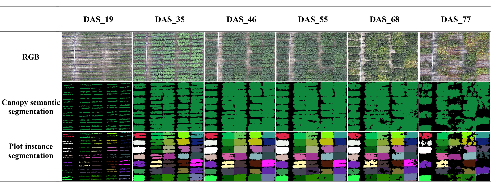

# STANet-TLA

leveraging deep learning and prior knowledge for large-scale soybean breeding plot segmentation and high-yielding variety screening from UAV time-series data

## Overview

Shaochen Li1, Yinmeng Song1, Ke Wang1, Yiqiang Liu1,2, Junhong Xian1, Hongshan Wu1, Xintong Zhang1, Yanjun Su3, Jin Wu4, Qinghua Guo5, Shan Xu1, Dong Jiang1,2, Jiao Wang1, Jinming Zhao1, Xianzhong Feng, Lijuan Qiu7, Yanfeng Ding1,2, Shichao Jin1,2*

1 Engineering Research Center of Plant Phenotyping, Ministry of Education, Academy for Advanced Interdisciplinary Studies, Collaborative Innovation Centre for Modern Crop Production co-sponsored by Province and Ministry, State Key Laboratory of Crop Genetics and Germplasm Enhancement, Jiangsu Key Laboratory of Soybean Biotechnology and Intelligent Breeding, Zhongshan Biological Breeding Laboratory，Nanjing Agricultural University, Nanjing 210095, China.

2 Sanya Research Institute of Nanjing Agriculture University, Sanya 572024, China

3 State Key Laboratory of Vegetation and Environmental Change, Institute of Botany, Chinese Academy of Sciences, Beijing 100093, China

4 Division for Ecology and Biodiversity, School of Biological Sciences, The University of Hong Kong, Pokfulam Road, Hong Kong, China

5 Institute of Remote Sensing and Geographic Information System, School of Earth and Space Sciences, Peking University, Beijing 100871, China

6 Key Laboratory of Soybean Molecular Design Breeding, State Key Laboratory of Black Soils Conservation and Utilization, Northeast Institute of Geography and Agroecology, Chinese Academy of Sciences, Changchun 130102, China.

7 The National Key Facility for Crop Gene Resources and Genetic Improvement (NFCRI)/Key Laboratory of Crop Gene Resource and Germplasm Enhancement (MOA)/Key Laboratory of Soybean Biology (Beijing) (MOA), Institute of Crop Science, Chinese Academy of Agricultural Sciences, Beijing 100081, China

*Corresponding author

Shichao Jin, Associate professor

Head of AiPhenomics Lab, Nanjing Agricultural University

Senior Editor of Plant Phenomics

Email: jschaon@njau.edu.cn; Tel: +86 025 8439-6112

Address: No. 666, Binjiang Avenue, Jiangbei New District, Nanjing 210095, China

## The Visualization results of STANet-TLA

## Installation of SATNet

For installation instructions, please refer to [install.md](https://github.com/Jinlab-AiPhenomics/STANet-TLA/tree/main/docs/install.md).

## Usage

### Dataset Construction

Please refer to [dataset.md](https://github.com/Jinlab-AiPhenomics/STANet-TLA/tree/main/docs/dataset.md) for details on dataset construction.

> 📦 A toy dataset has been constructed for testing. You can [click here](https://www.plantplus.cn/doi/10.12282/plantdata.1656)) to download it.

### Training and Testing

For training and testing procedures, please refer to [Train and test.md](https://github.com/Jinlab-AiPhenomics/STANet-TLA/tree/main/docs/train%20and%20test.md).

### Visualization

For visualization techniques, please refer to [visualization.md](https://github.com/Jinlab-AiPhenomics/STANet-TLA/tree/main/docs/visualization.md).

## Public Datasets

This study has constructed four datasets dedicated to various aspects of network development, robustness verification, across-year transferability assessment, across-location transferability assessment, and across-data type transferability assessment. Some datasets are open-source; you can download them using the links below:

1. **SoyUAV2022SY** (size: ~2.40 GB)
   - Part1: Uploading
2. **SoyUAV2023SY** (size: ~0.53 GB)
   - Part1: Uploading
3. **SoyUAV2022NJ** (size: ~0.73 GB)
   - Part1: Uploading
4. **SoyUAV2022SYchm** (size: ~2.17 GB)
   - Part1: Uploading

## License

This project is licensed under the [GPL-3.0](LICENSE) License © STANet-TLA
