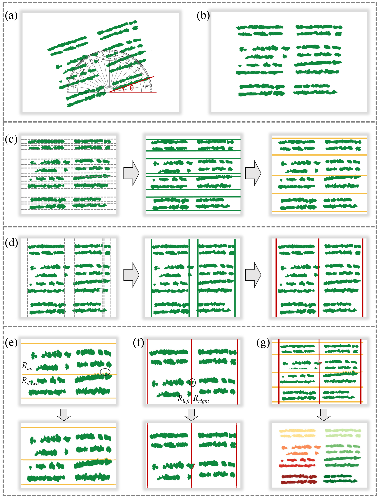

## Overview of TLA architecture. 

Overview of the TLA method. (a) The rotation angle (θ) of original canopy semantic segmentation map, which is measured using a protractor. (b) The results of rotated canopy semantic segmentation map. Generation of (c) horizontal traction lines (HTLs) and (d) vertical traction lines (VTLs). Optimization of (e) HTLs and (f) VTLs. The black circles represented intersected traction lines (TLs) need to be optimized. (g) The results of plot instance segmentation. The gray lines represent the preliminary TLs, the green lines represent the retained TLs of plot boundaries. The yellow lines represent the HTLs (before and after optimization), and the red lines represent the plot VTLs (before and after optimization). 
