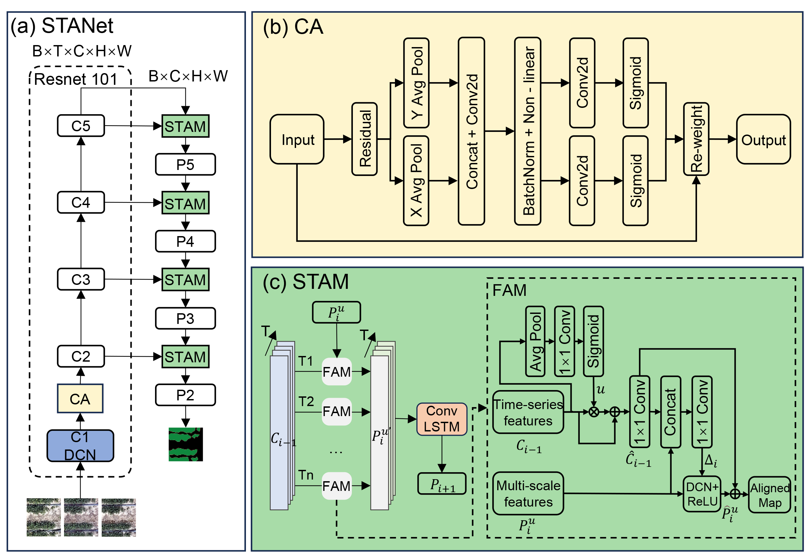

## Overview of STANet architecture. 

## Overview of TLA architecture. 

## The visualization results for canopy semantic segmentation at 37 days after sowing of STANet

## The visualization results for plot instance segmentation at 37 days after sowing of TLA

